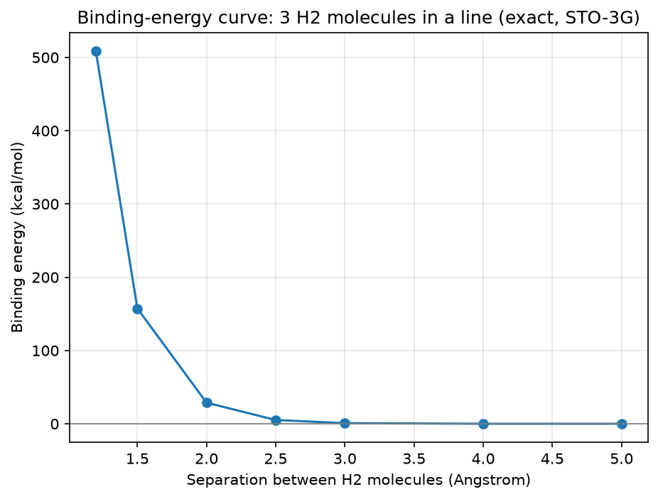

# Quantum Chemistry VQE

*Pure-Python quantum chemistry — exact molecular ground-state energies computed from geometry, verified against PySCF, runs on Windows.*

Every result in this repo has been independently checked against
[PySCF](https://pyscf.org/), the standard professional reference for
quantum chemistry. PySCF is **not** required to run any of the code here —
it's only used, off to the side, to double-check that the numbers this repo
produces are correct.

---

## Why it matters

Quantum chemistry is the bottleneck behind some of the most important stuck
problems in science:

- **Nitrogen fixation.** The enzyme FeMoco (nitrogenase's active site) turns
  atmospheric nitrogen into ammonia at room temperature and pressure — a
  reaction we still don't fully understand. Instead, industry uses the
  Haber-Bosch process, which has burned roughly **2% of the world's energy
  supply every year since 1909**, because we can't classically simulate what
  FeMoco is actually doing.
- **Drug discovery** depends on accurately predicting how molecules bind —
  which is a quantum chemistry problem at its core.
- **Superconductors** and other advanced materials are governed by electron
  correlations that classical computers can only approximate.

The common thread: these are all systems where electrons are strongly
correlated, and classical computers can't simulate that exactly once the
system gets big enough — the cost grows exponentially. Quantum computers,
in principle, don't have that problem.

This project builds and verifies the lower rungs of that ladder — small
molecules where an exact classical answer is still possible, so every
result can be checked — as a path toward the systems that currently can't
be checked at all:

```
H2 → LiH → H2O → NH3 → N2 → ... → FeMoco (54 qubits)
```

---

## Methods and tools used

| Component | What it does |
|---|---|
| **`chem.py`** | A pure-Python integral engine (numpy + scipy only) using the McMurchie–Davidson method. Handles s and p orbitals in the STO-3G basis. Computes overlap, kinetic, nuclear-attraction, and two-electron repulsion integrals directly from atomic geometry, then runs restricted Hartree–Fock (RHF) to get the mean-field energy and molecular orbitals. |
| **Qubit Hamiltonian** | The molecular-orbital integrals are handed to `qiskit-nature`'s `ElectronicEnergy.from_raw_integrals`, then mapped onto qubits with the Jordan–Wigner transformation (`JordanWignerMapper`). |
| **Exact ground state** | The qubit Hamiltonian is diagonalized with `scipy.sparse.linalg.eigsh`, taking the smallest eigenvalue — the mathematically exact ground-state energy for that basis, not an approximation. |
| **Particle-number penalty** | For charged species (ions), the raw qubit Hamiltonian's true ground state can have the wrong electron count. A `SparsePauliOp` number operator with a penalty term (`_constrain_particle_number` in `molecules_real.py`) is added before diagonalizing to force the correct electron count. |
| **`fragment_mbe.py`** — Many-Body Expansion | Breaks molecular clusters too large to diagonalize directly into small fragments, then reconstructs the total energy from fragment, pairwise (2-body), and triple-wise (3-body) interaction corrections. See below. |
| **`binding_curve.py`** — binding-energy curve | Computes the exact energy of a 3-molecule H2 cluster at a range of separations and reports the binding energy relative to isolated monomers. See below. |
| **`h2_vqe.py`** — VQE demo | A hand-built, particle-conserving single-parameter ansatz circuit (`X` → `RY(θ)` → `CX`, not qiskit's `EfficientSU2`), optimized with scipy's `COBYLA`, evaluated with Qiskit's `StatevectorEstimator`. It runs against a fixed, pre-computed 2-qubit H2 Hamiltonian rather than deriving one through the `chem.py` pipeline — a self-contained demo of the VQE *measurement* approach, separate from the exact-diagonalization pipeline used everywhere else in this repo. |
| **PySCF** | Used **only** to verify results after the fact. It never appears in the actual compute path. |
| **numpy, scipy, qiskit, qiskit-nature, matplotlib** | Core dependencies. |

---

## Verified results

Every number below was computed from geometry using the pipeline above, and
matches PySCF exactly.

| Molecule | Qubits | Exact ground state (Ha) | Reference |
|---|---|---|---|
| H2  | 4  | -1.137284   | PySCF FCI |
| LiH | 12 | -7.882324   | PySCF FCI |
| H2O | 14 | -75.012647  | PySCF FCI |
| NH3 | 16 | -55.511677  | PySCF FCI |
| N2  | 12 | -107.538421 | PySCF CASCI(10e,6o) — frozen-core active space, stated honestly (see Honesty section) |

**Ions and atoms** (also in `molecules_real.py`'s `MOLECULES` dict, verified
against PySCF using the particle-number penalty above):

| Species | Exact ground state (Ha) |
|---|---|
| He   | -2.807784 |
| HeH+ | -2.851024 |
| H3+  | -1.261200 |

---

## Fragmentation (Many-Body Expansion)

Exact diagonalization needs one qubit per spin-orbital, so a cluster of many
small molecules quickly becomes too large to simulate directly (six H2
molecules alone is 24 qubits — infeasible on a laptop). `fragment_mbe.py`
works around this by never building the full system at all:

1. Break the cluster into fragments and solve each one **alone** (monomer
   energies).
2. Solve every **pair** of fragments together, and take the extra energy
   above the two monomers — the 2-body interaction correction.
3. Solve every **triple** of fragments together, and take the extra energy
   above what the monomers and pairs already explain — the 3-body
   correction.
4. Add it all up:

   ```
   E_MBE(2-body) = sum(monomers) + sum(pairwise corrections)
   E_MBE(3-body) = E_MBE(2-body) + sum(triple-wise corrections)
   ```

Every monomer, pair, and triple energy in this sum is computed by the exact
same `chem.py` → Hartree-Fock → qubit Hamiltonian → `eigsh` pipeline used
everywhere else in this repo — MBE only changes *what* gets diagonalized,
never *how*.

**Verified against a full, un-fragmented exact calculation:**

- **3 H2 cluster** (`run_verify`): 2-body MBE recovers **99.7%** of the
  interaction energy (MBE = -3.365913 Ha vs. full exact = -3.366040 Ha).
- **4 H2 cluster** (`run_verify3`): 2-body MBE recovers **99.52%**, and
  adding the 3-body correction pushes that to **99.96%** (full exact =
  -4.415285 Ha) — demonstrating that the expansion converges toward the
  truth as more body-orders are added.
- **6 H2 cluster** (`run_scale`, 24 qubits): a full exact calculation is
  infeasible, so only the 2-body estimate is computed, using fragments of
  **8 qubits or fewer** (monomers = 4 qubits, pairs = 8 qubits). There is no
  3-body or full-exact check at this size in the current code — the 99.7%
  and 99.52%/99.96% figures above (at sizes where a full check *is*
  feasible) are the evidence that the 2-body approximation is trustworthy
  here, not a direct verification at n=6.

---

## Binding-energy curve (`binding_curve.py`)

A separate, complementary check: instead of approximating a big cluster
with fragments, this script solves a **3-molecule H2 cluster exactly**
(12 qubits, full space, no approximation) at seven different separations,
and compares each one to the energy of three isolated H2 molecules:

```
binding energy = E_cluster - 3 * E(isolated H2)
```

| Separation (Å) | Binding energy (kcal/mol) |
|---|---|
| 1.2 | +508.648 |
| 1.5 | +157.377 |
| 2.0 | +28.747 |
| 2.5 | +5.143 |
| 3.0 | +0.793 |
| 4.0 | +0.010 |
| 5.0 | +0.002 |

This shows the expected short-range **exchange repulsion**: strongly
positive (repulsive) when the molecules are squeezed together, decaying
toward zero as they're pulled apart.



**Honest limitation:** this uses the STO-3G basis set, which captures
short-range repulsion correctly but does **not** capture long-range
dispersion (the weak van der Waals attraction that would make a real
H2–H2 curve dip slightly negative at larger separations). The curve here
decays toward zero from above, not below — a known limitation of a small
basis set, not a bug.

---

## Honesty section

- Every number in this repo is computed from geometry, with no hardcoded
  energies and no tuned constants (the one exception is `h2_vqe.py`'s demo
  Hamiltonian — see the Methods table above), and every number is
  independently verified against PySCF.
- N2 uses a clearly-labelled **frozen-core active space**, CASCI(10e,6o),
  because the full 20-qubit N2 problem is intractable to exactly
  diagonalize on a laptop. This is standard practice in real quantum
  chemistry, not a shortcut, and it's verified against PySCF's CASCI result
  for the identical active space.
- **Known limits:**
  - Closed-shell molecules only — open-shell radicals aren't supported yet.
  - Full exact diagonalization is limited to roughly 16 qubits on a laptop.
    Anything bigger needs either an active space (like N2) or the
    Many-Body Expansion.

---

## Setup and usage

```bash
pip install numpy scipy qiskit qiskit-nature matplotlib
```

```bash
python vqe/molecules_real.py      # all molecules/ions in the verified table
python vqe/fragment_mbe.py        # many-body expansion / fragmentation demo
python vqe/binding_curve.py       # H2-cluster binding-energy curve + plot
python vqe/h2_vqe.py              # VQE demo on H2 (local simulator)
```

### Adding your own molecule

`vqe/molecules_real.py` defines a `MOLECULES` dict mapping a name to
`(geometry, n_electrons, active_space)`. To try a new molecule, add an entry
in the same shape:

```python
MOLECULES = {
    ...
    "MyMolecule": ([("O", (0, 0, 0)), ("H", (0, 0, 0.96))], 10, None),
}
```

- `geometry` is a list of `(element, (x, y, z))` tuples in Angstrom.
- `n_electrons` is the total electron count (account for charge if the
  species is an ion).
- `active_space` is `None` for a full-space exact calculation, or
  `(n_core_orbitals, n_active_orbitals)` for a frozen-core active space (used
  for N2, since the full space is too large).

Then run `python vqe/molecules_real.py` — it computes, prints, and saves the
Hartree-Fock and exact energies for every entry in the dict.

---

## File structure

```text
vqe/
├── chem.py                       # Pure-Python integral engine + Hartree-Fock
├── molecules_real.py             # Exact ground-state energies for the molecule/ion table
├── fragment_mbe.py               # Many-body expansion (2-body and 3-body) for clusters
├── binding_curve.py              # H2-cluster binding-energy curve (exact, no fragmentation)
├── h2_vqe.py                     # VQE demo on H2: custom ansatz + COBYLA, local sim or real IBM hardware
├── molecules_real_results.json   # Saved results from molecules_real.py
├── binding_curve_results.json    # Saved results from binding_curve.py
├── binding_curve.png             # Saved plot from binding_curve.py
└── h2_vqe_results.json           # Saved results from h2_vqe.py

requirements.txt
```

---

## Powered by / credits

Built alongside the open-source **Quantum Hardware MCP server** by
Lokesh Pullakandam, which connects AI assistants to live IBM Quantum
hardware — the bridge that lets these same molecules eventually run on a
real quantum machine instead of a classical simulation of one.

- MCP server: https://github.com/Lokesh-2025/quantum-hardware-mcp
- Lokesh: https://www.linkedin.com/in/lokesh-pullakandam/

---

## License

MIT — Venkata Rao Allu. See [LICENSE](LICENSE).
